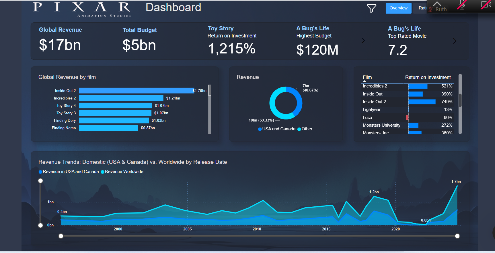

# About this project
This report explores 30 years of Pixar's film history, diving into key aspects such as genres, ratings, and revenue performance. It provides insights into how Pixar's films have evolved and performed over time, offering both high-level overviews and detailed breakdowns.
Link to Dashboard

# Structure and Scope of the Dataset:

The dataset contains information about Pixar films over the past 30 years. It includes features such as movie genres, release years, ratings, box office performance, and directors. The data provides a comprehensive view of Pixar's journey, highlighting trends in audience preferences, critical reception, and financial success.

**The dataset covers key aspects such as:**

Genres: Analyzing the popularity and distribution of genres such as "Adventure," "Animation," and more.
Ratings: Trends in film ratings across decades, showing the evolution of audience and critical reception.
Revenue: Box office performance and revenue breakdowns by film.
Directors' Contribution: Insights into individual directors' impact on Pixar's success.
Tools and Technologies Used:

🖥️ Power BI: For creating dynamic and interactive visualizations to explore trends and patterns.
🔢 DAX: Used for custom calculations, including trends in genres, ratings, and revenue performance.
The dataset comprises 7 CSV files, each containing detailed insights into Pixar's filmography, revenue, ratings, and related metrics. License: Maven Analytics

# Data Processing and Analysis: The dataset underwent significant preparation to ensure clarity and accuracy. Steps included:

✨ Standardizing column names for consistency.
✨ Standardization of release dates to a uniform format.
✨Filtering out irrelevant records to maintain focus on Pixar-related insights.
Visualization and Data Exploration: Using Power BI, a variety of visualizations were created, including:

# Genre distribution charts.
Trends in ratings and revenue over time.
Directors' contributions to Pixar's success.
A decision tree visualization to break down performance metrics by film attributes.
Interactive Dashboards: Interactive dashboards allow users to navigate data with slicers (e.g., by year, rating or director) and focus on key trends like revenue peaks or genre popularity.

# Key Findings:

⭐ Financial Performance: Return on Investment (ROI) highlights include Toy Story at a remarkable 1215%, Finding Nemo at 827%, and A Bug's Life at 203%. Turning Red faced significant financial challenges, recording a profit margin of -88%.

⭐Revenue trends: From 2020 to 2022, Pixar experienced financial struggles, with three films reporting negative profit margins, reflecting the impact of the pandemic era.

⭐ Critical & Audience Reception: Coco and Wall-E both achieving high IMDb scores (8.4), they do not appear in the top 10 most profitable Pixar movies. ⭐ Production Insights: Andrew Stanton has made the most contributions to Pixar movies, both as a screenwriter and director. Brad Bird has eared 2,5 bn.

⭐ Regional Revenue Distribution: International markets dominate, contributing 59% of revenue compared to 41% from domestic markets.

# Learning and Value Creation:

By analyzing financial trends, audience ratings, and production details, this project offers insights into the evolving landscape of Pixar films. It demonstrates the importance of leveraging data visualization to understand long-term trends and guide decision-making.
